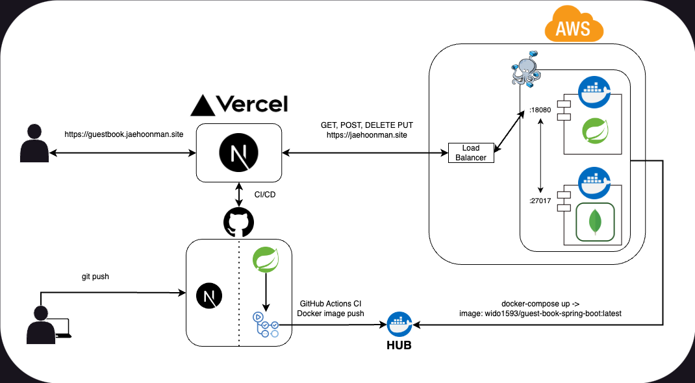
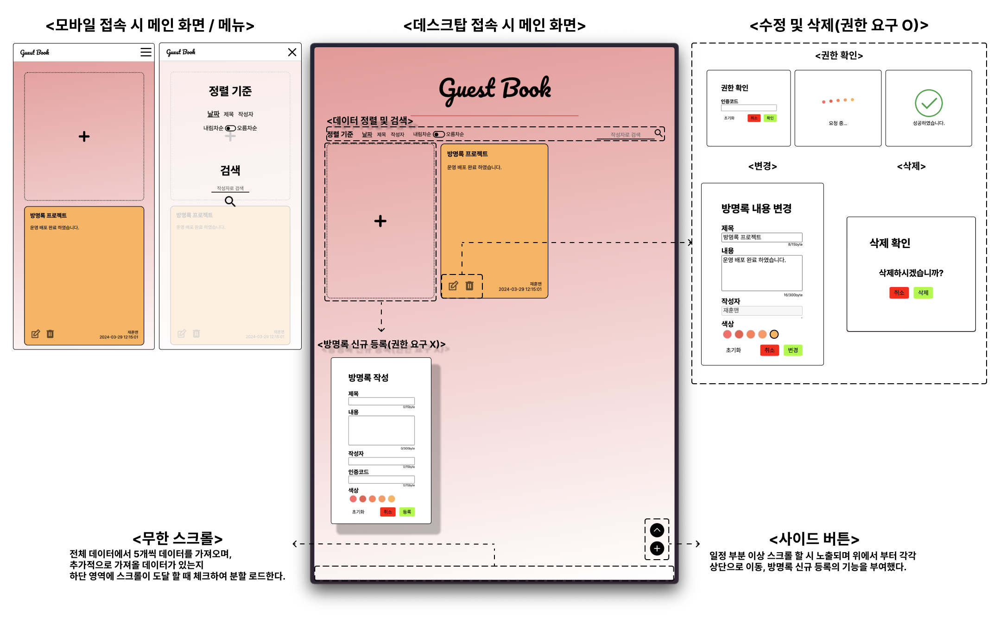

# 방명록 프로젝트 Frontend By Next.js

---

## 프로젝트 정보
방문자가 방명록 데이터를 작성, 수정, 삭제, 검색, 정렬할 수 있는 기능을 가진 웹 애플리케이션.

## 구조, 구성

Server - Client 구성, Next.js로 구성된 Front와 REST API로 요청을 받는 Spring Boot Backend.

## 역할
방명록 데이터의 CRUD 요청을 클라이언트로부터 요청받아 Backend로 넘겨주기 위한 Frontend.

## 특징
- SPA 구성.
- App Router 기법 사용.
- 무한 스크롤 적용.
- 모바일 / 데스크탑 디바이스에 따른 스타일 변화.

## 기능 설명

## 프로젝트 링크
- [방명록 프로젝트 회고록](https://jaehoonmandev.github.io/side%20project/guestbook-retrospective/)
- [Backend 소스](https://github.com/jaehoonmandev/guest-book-spring-boot)
- ~~[재훈맨 방명록](https://guestbook.jaehoonman.site/)~~
